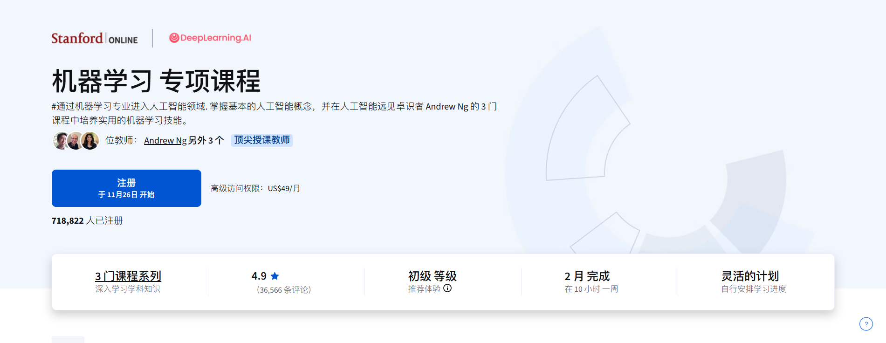

# README

吴恩达机器学习专项课程-可选实验/练习测试中文版（已全部翻译），可以导入colab，或者用VS/Cursor/Windsurf学习查看

使用AI自动翻译的，错误的地方可以一起完善，后续考虑补充colab实验地址

翻译自：https://github.com/greyhatguy007/Machine-Learning-Specialization-Coursera

包含 [机器学习专项课程](https://www.coursera.org/specializations/machine-learning-introduction/?utm_medium=coursera&utm_source=home-page&utm_campaign=mlslaunch2022IN) 的解决方案和笔记，由 Coursera 上的吴恩达（Andrew NG）教授主讲。

# 机器学习专项课程 Coursera

**注意：如果您想通过理解所需的数学知识来更深入地理解这些概念，请查看 [机器学习与数据科学数学专项课程](https://github.com/greyhatguy007/Mathematics-for-Machine-Learning-and-Data-Science-Specialization-Coursera)**

## 课程 1：[监督学习：回归与分类](https://www.coursera.org/learn/machine-learning?specialization=machine-learning-introduction)

- [第 1 周](./C1%20-%20Supervised%20Machine%20Learning%20-%20Regression%20and%20Classification/week1)

    - [练习测验：回归](./C1%20-%20Supervised%20Machine%20Learning%20-%20Regression%20and%20Classification/week1/Practice%20quiz%20-%20Regression)
    - [练习测验：监督学习 vs 无监督学习](./C1%20-%20Supervised%20Machine%20Learning%20-%20Regression%20and%20Classification/week1/Practice%20quiz%20-%20Supervised%20vs%20unsupervised%20learning)
    - [练习测验：使用梯度下降训练模型](./C1%20-%20Supervised%20Machine%20Learning%20-%20Regression%20and%20Classification/week1/Practice%20quiz%20-%20Train%20the%20model%20with%20gradient%20descent)
  - [可选实验](./C1%20-%20Supervised%20Machine%20Learning%20-%20Regression%20and%20Classification/week1/Optional%20Labs)
    - [模型表示](./C1%20-%20Supervised%20Machine%20Learning%20-%20Regression%20and%20Classification/week1/Optional%20Labs/C1_W1_Lab03_Model_Representation_Soln.ipynb)
    - [代价函数](./C1%20-%20Supervised%20Machine%20Learning%20-%20Regression%20and%20Classification/week1/Optional%20Labs/C1_W1_Lab04_Cost_function_Soln.ipynb)
    - [梯度下降](./C1%20-%20Supervised%20Machine%20Learning%20-%20Regression%20and%20Classification/week1/Optional%20Labs/C1_W1_Lab05_Gradient_Descent_Soln.ipynb)

 

- [第 2 周](./C1%20-%20Supervised%20Machine%20Learning%20-%20Regression%20and%20Classification/week2) 

    - [练习测验：梯度下降实践](./C1%20-%20Supervised%20Machine%20Learning%20-%20Regression%20and%20Classification/week2/Practice%20quiz%20-%20Gradient%20descent%20in%20practice)
    - [练习测验：多元线性回归](./C1%20-%20Supervised%20Machine%20Learning%20-%20Regression%20and%20Classification/week2/Practice%20quiz%20-%20Multiple%20linear%20regression)
    - [可选实验](./C1%20-%20Supervised%20Machine%20Learning%20-%20Regression%20and%20Classification/week2/Optional%20Labs)
      - [Numpy 向量化](./C1%20-%20Supervised%20Machine%20Learning%20-%20Regression%20and%20Classification/week2/Optional%20Labs/C1_W2_Lab01_Python_Numpy_Vectorization_Soln.ipynb)
      - [多元回归](./C1%20-%20Supervised%20Machine%20Learning%20-%20Regression%20and%20Classification/week2/Optional%20Labs/C1_W2_Lab02_Multiple_Variable_Soln.ipynb)
      - [特征缩放](./C1%20-%20Supervised%20Machine%20Learning%20-%20Regression%20and%20Classification/week2/Optional%20Labs/C1_W2_Lab03_Feature_Scaling_and_Learning_Rate_Soln.ipynb)
      - [特征工程](./C1%20-%20Supervised%20Machine%20Learning%20-%20Regression%20and%20Classification/week2/Optional%20Labs/C1_W2_Lab04_FeatEng_PolyReg_Soln.ipynb)
      - [Sklearn 梯度下降](./C1%20-%20Supervised%20Machine%20Learning%20-%20Regression%20and%20Classification/week2/Optional%20Labs/C1_W2_Lab05_Sklearn_GD_Soln.ipynb)
      - [Sklearn 正规方程法](./C1%20-%20Supervised%20Machine%20Learning%20-%20Regression%20and%20Classification/week2/Optional%20Labs/C1_W2_Lab06_Sklearn_Normal_Soln.ipynb)
    - [编程作业](./C1%20-%20Supervised%20Machine%20Learning%20-%20Regression%20and%20Classification/week2/C1W2A1)
      - [线性回归](./C1%20-%20Supervised%20Machine%20Learning%20-%20Regression%20and%20Classification/week2/C1W2A1/C1_W2_Linear_Regression.ipynb)

 

- [第 3 周](./C1%20-%20Supervised%20Machine%20Learning%20-%20Regression%20and%20Classification/week3)

    - [练习测验：逻辑回归的代价函数](./C1%20-%20Supervised%20Machine%20Learning%20-%20Regression%20and%20Classification/week3/Practice%20quiz%20-%20Cost%20function%20for%20logistic%20regression)
    - [练习测验：逻辑回归的梯度下降](./C1%20-%20Supervised%20Machine%20Learning%20-%20Regression%20and%20Classification/week3/Practice%20quiz%20-%20Gradient%20descent%20for%20logistic%20regression)
    - [可选实验](./C1%20-%20Supervised%20Machine%20Learning%20-%20Regression%20and%20Classification/week3/Optional%20Labs)
        - [分类](./C1%20-%20Supervised%20Machine%20Learning%20-%20Regression%20and%20Classification/week3/Optional%20Labs/C1_W3_Lab01_Classification_Soln.ipynb)
        - [Sigmoid 函数](./C1%20-%20Supervised%20Machine%20Learning%20-%20Regression%20and%20Classification/week3/Optional%20Labs/C1_W3_Lab02_Sigmoid_function_Soln.ipynb)
        - [决策边界](./C1%20-%20Supervised%20Machine%20Learning%20-%20Regression%20and%20Classification/week3/Optional%20Labs/C1_W3_Lab03_Decision_Boundary_Soln.ipynb)
        - [逻辑损失](./C1%20-%20Supervised%20Machine%20Learning%20-%20Regression%20and%20Classification/week3/Optional%20Labs/C1_W3_Lab04_LogisticLoss_Soln.ipynb)
        - [代价函数](./C1%20-%20Supervised%20Machine%20Learning%20-%20Regression%20and%20Classification/week3/Optional%20Labs/C1_W3_Lab05_Cost_Function_Soln.ipynb)
        - [梯度下降](./C1%20-%20Supervised%20Machine%20Learning%20-%20Regression%20and%20Classification/week3/Optional%20Labs/C1_W3_Lab06_Gradient_Descent_Soln.ipynb)
        - [Scikit Learn - 逻辑回归](./C1%20-%20Supervised%20Machine%20Learning%20-%20Regression%20and%20Classification/week3/Optional%20Labs/C1_W3_Lab07_Scikit_Learn_Soln.ipynb)
        - [过拟合](./C1%20-%20Supervised%20Machine%20Learning%20-%20Regression%20and%20Classification/week3/Optional%20Labs/C1_W3_Lab08_Overfitting_Soln.ipynb)
        - [正则化](./C1%20-%20Supervised%20Machine%20Learning%20-%20Regression%20and%20Classification/week3/Optional%20Labs/C1_W3_Lab09_Regularization_Soln.ipynb)
    - [编程作业](./C1%20-%20Supervised%20Machine%20Learning%20-%20Regression%20and%20Classification/week3/C1W3A1)
      - [逻辑回归](./C1%20-%20Supervised%20Machine%20Learning%20-%20Regression%20and%20Classification/week3/C1W3A1/C1_W3_Logistic_Regression.ipynb)

#### [完成证书](https://coursera.org/share/195768f3c1a83e42298d3f61dae99d01)

 

## 课程 2：[高级学习算法](https://www.coursera.org/learn/advanced-learning-algorithms?specialization=machine-learning-introduction)

- [第 1 周](./C2%20-%20Advanced%20Learning%20Algorithms/week1)
    - [练习测验：神经网络直觉](./C2%20-%20Advanced%20Learning%20Algorithms/week1/Practice%20quiz%20-%20Neural%20networks%20intuition)
    - [练习测验：神经网络模型](./C2%20-%20Advanced%20Learning%20Algorithms/week1/Practice%20quiz%20-%20Neural%20network%20model)
    - [练习测验：TensorFlow 实现](./C2%20-%20Advanced%20Learning%20Algorithms/week1/Practice%20quiz%20-%20TensorFlow%20implementation)
    - [练习测验：使用 Numpy 实现神经网络](./C2%20-%20Advanced%20Learning%20Algorithms/week1/Practice-Quiz-Neural-Networks-Implementation-in-python)
    - [可选实验](./C2%20-%20Advanced%20Learning%20Algorithms/week1/optional-labs)
      - [神经元和层](./C2%20-%20Advanced%20Learning%20Algorithms/week1/optional-labs/C2_W1_Lab01_Neurons_and_Layers.ipynb)
      - [咖啡烘焙](./C2%20-%20Advanced%20Learning%20Algorithms/week1/optional-labs/C2_W1_Lab02_CoffeeRoasting_TF.ipynb)
      - [使用 Numpy 实现咖啡烘焙](./C2%20-%20Advanced%20Learning%20Algorithms/week1/optional-labs/C2_W1_Lab02_CoffeeRoasting_TF.ipynb)
    - [编程作业](./C2%20-%20Advanced%20Learning%20Algorithms/week1/C2W1A1)
      - [用于二分类的神经网络](./C2%20-%20Advanced%20Learning%20Algorithms/week1/C2W1A1/C2_W1_Assignment.ipynb)
  

   

- [第 2 周](./C2%20-%20Advanced%20Learning%20Algorithms/week2)
    - [练习测验：神经网络训练](./C2%20-%20Advanced%20Learning%20Algorithms/week2/Practice-Quiz-Neural-Network-Training)
    - [练习测验：激活函数](./C2%20-%20Advanced%20Learning%20Algorithms/week2/Practice-Quiz-Activation-Functions)
    - [练习测验：多分类](./C2%20-%20Advanced%20Learning%20Algorithms/week2/Practice-quiz-Multiclass-Classification)
    - [练习测验：其他神经网络概念](./C2%20-%20Advanced%20Learning%20Algorithms/week2/Practice-Quiz-Additional-Neural-Network-Concepts)
    - [可选实验](./C2%20-%20Advanced%20Learning%20Algorithms/week2/optional-labs)
        - [ReLU](./C2%20-%20Advanced%20Learning%20Algorithms/week2/optional-labs/C2_W2_Relu.ipynb)
        - [Softmax](./C2%20-%20Advanced%20Learning%20Algorithms/week2/optional-labs/C2_W2_SoftMax.ipynb)
        - [多分类](./C2%20-%20Advanced%20Learning%20Algorithms/week2/optional-labs/C2_W2_Multiclass_TF.ipynb)
    - [编程作业](./C2%20-%20Advanced%20Learning%20Algorithms/week2/C2W2A1)
      - [用于手写数字识别的神经网络 - 多分类](./C2%20-%20Advanced%20Learning%20Algorithms/week2/C2W2A1/C2_W2_Assignment.ipynb)
    

 

- [第 3 周](./C2%20-%20Advanced%20Learning%20Algorithms/week3)
    - [练习测验：应用机器学习的建议](./C2%20-%20Advanced%20Learning%20Algorithms/week3/Practice-Quiz-Advice-for-applying-machine-learning)    
    - [练习测验：偏差和方差](./C2%20-%20Advanced%20Learning%20Algorithms/week3/practice-quiz-bias-and-variance)
    - [练习测验：机器学习开发流程](./C2%20-%20Advanced%20Learning%20Algorithms/week3/practice-quiz-machine-learning-development-process)
    - [编程作业](./C2%20-%20Advanced%20Learning%20Algorithms/week3/C2W3A1)
        - [应用机器学习建议](./C2%20-%20Advanced%20Learning%20Algorithms/week3/C2W3A1/C2_W3_Assignment.ipynb)

 

- [第 4 周](./C2%20-%20Advanced%20Learning%20Algorithms/week4)
    - [练习测验：决策树](./C2%20-%20Advanced%20Learning%20Algorithms/week4/practice-quiz-decision-trees)
    - [练习测验：决策树学习](./C2%20-%20Advanced%20Learning%20Algorithms/week4/practice-quiz-decision-tree-learning)
    - [练习测验：决策树集成](./C2%20-%20Advanced%20Learning%20Algorithms/week4/practice-quiz-tree-ensembles)
    - [编程作业](./C2%20-%20Advanced%20Learning%20Algorithms/week4/C2W4A1)
        - [决策树](./C2%20-%20Advanced%20Learning%20Algorithms/week4/C2W4A1/C2_W4_Decision_Tree_with_Markdown.ipynb)

#### [完成证书](https://coursera.org/share/c9a7766b0c6eab27db2e955376d29bf7)        

 

## 课程 3：[无监督学习、推荐系统、强化学习](https://www.coursera.org/learn/unsupervised-learning-recommenders-reinforcement-learning?specialization=machine-learning-introduction)

 

- [第 1 周](./C3%20-%20Unsupervised%20Learning%2C%20Recommenders%2C%20Reinforcement%20Learning/week1)
    - [练习测验：聚类](./C3%20-%20Unsupervised%20Learning%2C%20Recommenders%2C%20Reinforcement%20Learning/week1/Practice%20Quiz%20-%20Clustering)
    - [练习测验：异常检测](./C3%20-%20Unsupervised%20Learning%2C%20Recommenders%2C%20Reinforcement%20Learning/week1/Practice%20Quiz%20-%20Anomaly%20Detection)
    - [编程作业](./C3%20-%20Unsupervised%20Learning%2C%20Recommenders%2C%20Reinforcement%20Learning/week1/C3W1A)
        - [K 均值](./C3%20-%20Unsupervised%20Learning%2C%20Recommenders%2C%20Reinforcement%20Learning/week1/C3W1A/C3W1A1/C3_W1_KMeans_Assignment.ipynb)
        - [异常检测](./C3%20-%20Unsupervised%20Learning%2C%20Recommenders%2C%20Reinforcement%20Learning/week1/C3W1A/C3W1A2/C3_W1_Anomaly_Detection.ipynb)

 

- [第 2 周](./C3%20-%20Unsupervised%20Learning%2C%20Recommenders%2C%20Reinforcement%20Learning/week2)
    - [练习测验：协同过滤](./C3%20-%20Unsupervised%20Learning%2C%20Recommenders%2C%20Reinforcement%20Learning/week2/Practice%20Quiz%20-%20Collaborative%20Filtering)
    - [练习测验：推荐系统实现](./C3%20-%20Unsupervised%20Learning%2C%20Recommenders%2C%20Reinforcement%20Learning/week2/Practice%20Quiz%20-%20Recommender%20systems%20implementation)
    - [练习测验：基于内容的过滤](./C3%20-%20Unsupervised%20Learning%2C%20Recommenders%2C%20Reinforcement%20Learning/week2/Practice%20Quiz%20-%20Content-based%20filtering)
    - [编程作业](./C3%20-%20Unsupervised%20Learning%2C%20Recommenders%2C%20Reinforcement%20Learning/week2/C3W2)
        - [协同过滤推荐系统](./C3%20-%20Unsupervised%20Learning%2C%20Recommenders%2C%20Reinforcement%20Learning/week2/C3W2/C3W2A1/C3_W2_Collaborative_RecSys_Assignment.ipynb)
        - [使用神经网络的推荐系统](./C3%20-%20Unsupervised%20Learning%2C%20Recommenders%2C%20Reinforcement%20Learning/week2/C3W2/C3W2A2/C3_W2_RecSysNN_Assignment.ipynb)

 

- [第 3 周](./C3%20-%20Unsupervised%20Learning%2C%20Recommenders%2C%20Reinforcement%20Learning/week3)
    - [练习测验：强化学习介绍](./C3%20-%20Unsupervised%20Learning%2C%20Recommenders%2C%20Reinforcement%20Learning/week3/Practice%20Quiz%20-%20Reinforcement%20learning%20introduction)
    - [练习测验：状态-动作价值函数](./C3%20-%20Unsupervised%20Learning%2C%20Recommenders%2C%20Reinforcement%20Learning/week3/Practice%20Quiz%20-%20State-action%20value%20function)
    - [练习测验：连续状态空间](./C3%20-%20Unsupervised%20Learning%2C%20Recommenders%2C%20Reinforcement%20Learning/week3/Practice%20Quiz%20-%20Continuous%20state%20spaces)
    - [编程作业](./C3%20-%20Unsupervised%20Learning%2C%20Recommenders%2C%20Reinforcement%20Learning/week3/C3W3A1)
        - [深度 Q 学习 - 月球着陆器](./C3%20-%20Unsupervised%20Learning%2C%20Recommenders%2C%20Reinforcement%20Learning/week3/C3W3A1/C3_W3_A1_Assignment.ipynb)
#### [完成证书](https://coursera.org/share/5bf5ee456b0c806df9b8622067b47ca6)

### [专项课程证书](https://coursera.org/share/a15ac6426f90924491a542850700a759)

 

 

                        
### 星标数随时间变化
                 

### 课程评价：

这门课程是成为机器学习工程师的最佳起点。即使您已经是专家，课程也深入涵盖了许多算法，如决策树，这有助于进一步提升您的技能。

**特别感谢 [吴恩达教授](https://www.andrewng.org/) 构建和定制了这门课程。**

 

#### 完成本专项课程后，您可能能够实现的内容：

* <i>编写无监督学习算法，使用深度 Q 学习实现**月球着陆器着陆**</i>

    - 在多次失败的尝试后，探测器经过训练能够正确地在表面着陆，准确地降落在作为指示器的旗帜之间。
    - 使用适当参数训练智能体后的最终着陆效果： 

https://user-images.githubusercontent.com/77543865/182395635-703ae199-ba79-4940-86eb-23dd90093ab3.mp4

* <i>编写**电影推荐系统**算法</i>
    
    - 根据电影类型收集电影数据库。
    - 训练基于内容的过滤和协同过滤算法，并实现电影推荐系统。
    - 根据电影类型提供电影推荐。

* <i>还有更多内容！！</i>

总而言之，这是一门我推荐每个人都学习的课程。不仅因为您能学到许多新知识，还因为作业都是现实生活中的例子，*完成它们令人兴奋*。

 

**祝学习愉快 :))**

 
 
